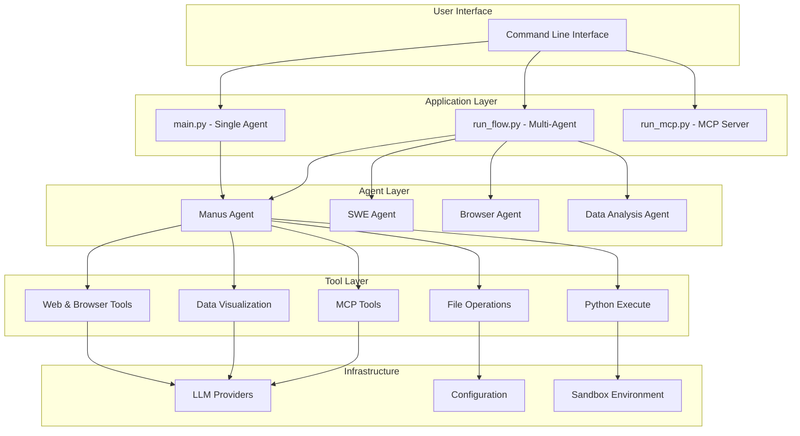

<<<<<<< HEAD
<p align="center">
  
</p>

English | [中文](README_zh.md) | [한국어](README_ko.md) | [日本語](README_ja.md)

[](https://github.com/FoundationAgents/OpenManus/stargazers)
&ensp;
[](https://opensource.org/licenses/MIT) &ensp;
[](https://discord.gg/DYn29wFk9z)
[](https://huggingface.co/spaces/lyh-917/OpenManusDemo)
[](https://doi.org/10.5281/zenodo.15186407)

# 👋 OpenManus

Manus is incredible, but OpenManus can achieve any idea without an *Invite Code* 🛫!

Our team members [@Xinbin Liang](https://github.com/mannaandpoem) and [@Jinyu Xiang](https://github.com/XiangJinyu) (core authors), along with [@Zhaoyang Yu](https://github.com/MoshiQAQ), [@Jiayi Zhang](https://github.com/didiforgithub), and [@Sirui Hong](https://github.com/stellaHSR), we are from [@MetaGPT](https://github.com/geekan/MetaGPT). The prototype is launched within 3 hours and we are keeping building!

It's a simple implementation, so we welcome any suggestions, contributions, and feedback!

Enjoy your own agent with OpenManus!

We're also excited to introduce [OpenManus-RL](https://github.com/OpenManus/OpenManus-RL), an open-source project dedicated to reinforcement learning (RL)- based (such as GRPO) tuning methods for LLM agents, developed collaboratively by researchers from UIUC and OpenManus.

## Project Demo

<video src="https://private-user-images.githubusercontent.com/61239030/420168772-6dcfd0d2-9142-45d9-b74e-d10aa75073c6.mp4?jwt=eyJhbGciOiJIUzI1NiIsInR5cCI6IkpXVCJ9.eyJpc3MiOiJnaXRodWIuY29tIiwiYXVkIjoicmF3LmdpdGh1YnVzZXJjb250ZW50LmNvbSIsImtleSI6ImtleTUiLCJleHAiOjE3NDEzMTgwNTksIm5iZiI6MTc0MTMxNzc1OSwicGF0aCI6Ii82MTIzOTAzMC80MjAxNjg3NzItNmRjZmQwZDItOTE0Mi00NWQ5LWI3NGUtZDEwYWE3NTA3M2M2Lm1wND9YLUFtei1BbGdvcml0aG09QVdTNC1ITUFDLVNIQTI1NiZYLUFtei1DcmVkZW50aWFsPUFLSUFWQ09EWUxTQTUzUFFLNFpBJTJGMjAyNTAzMDclMkZ1cy1lYXN0LTElMkZzMyUyRmF3czRfcmVxdWVzdCZYLUFtei1EYXRlPTIwMjUwMzA3VDAzMjIzOVomWC1BbXotRXhwaXJlcz0zMDAmWC1BbXotU2lnbmF0dXJlPTdiZjFkNjlmYWNjMmEzOTliM2Y3M2VlYjgyNDRlZDJmOWE3NWZhZjE1MzhiZWY4YmQ3NjdkNTYwYTU5ZDA2MzYmWC1BbXotU2lnbmVkSGVhZGVycz1ob3N0In0.UuHQCgWYkh0OQq9qsUWqGsUbhG3i9jcZDAMeHjLt5T4" data-canonical-src="https://private-user-images.githubusercontent.com/61239030/420168772-6dcfd0d2-9142-45d9-b74e-d10aa75073c6.mp4?jwt=eyJhbGciOiJIUzI1NiIsInR5cCI6IkpXVCJ9.eyJpc3MiOiJnaXRodWIuY29tIiwiYXVkIjoicmF3LmdpdGh1YnVzZXJjb250ZW50LmNvbSIsImtleSI6ImtleTUiLCJleHAiOjE3NDEzMTgwNTksIm5iZiI6MTc0MTMxNzc1OSwicGF0aCI6Ii82MTIzOTAzMC80MjAxNjg3NzItNmRjZmQwZDItOTE0Mi00NWQ5LWI3NGUtZDEwYWE3NTA3M2M2Lm1wND9YLUFtei1BbGdvcml0aG09QVdTNC1ITUFDLVNIQTI1NiZYLUFtei1DcmVkZW50aWFsPUFLSUFWQ09EWUxTQTUzUFFLNFpBJTJGMjAyNTAzMDclMkZ1cy1lYXN0LTElMkZzMyUyRmF3czRfcmVxdWVzdCZYLUFtei1EYXRlPTIwMjUwMzA3VDAzMjIzOVomWC1BbXotRXhwaXJlcz0zMDAmWC1BbXotU2lnbmF0dXJlPTdiZjFkNjlmYWNjMmEzOTliM2Y3M2VlYjgyNDRlZDJmOWE3NWZhZjE1MzhiZWY4YmQ3NjdkNTYwYTU5ZDA2MzYmWC1BbXotU2lnbmVkSGVhZGVycz1ob3N0In0.UuHQCgWYkh0OQq9qsUWqGsUbhG3i9jcZDAMeHjLt5T4" controls="controls" muted="muted" class="d-block rounded-bottom-2 border-top width-fit" style="max-height:640px; min-height: 200px"></video>

## Installation

We provide two installation methods. Method 2 (using uv) is recommended for faster installation and better dependency management.

### Method 1: Using conda

1. Create a new conda environment:

```bash
conda create -n open_manus python=3.12
conda activate open_manus
```

2. Clone the repository:

```bash
git clone https://github.com/FoundationAgents/OpenManus.git
cd OpenManus
```

3. Install dependencies:

```bash
pip install -r requirements.txt
```

### Method 2: Using uv (Recommended)

1. Install uv (A fast Python package installer and resolver):

```bash
curl -LsSf https://astral.sh/uv/install.sh | sh
```

2. Clone the repository:

```bash
git clone https://github.com/FoundationAgents/OpenManus.git
cd OpenManus
```

3. Create a new virtual environment and activate it:

```bash
uv venv --python 3.12
source .venv/bin/activate  # On Unix/macOS
# Or on Windows:
# .venv\Scripts\activate
```

4. Install dependencies:

```bash
uv pip install -r requirements.txt
```

### Browser Automation Tool (Optional)
```bash
playwright install
```

## Configuration

OpenManus requires configuration for the LLM APIs it uses. Follow these steps to set up your configuration:

1. Create a `config.toml` file in the `config` directory (you can copy from the example):

```bash
cp config/config.example.toml config/config.toml
```

2. Edit `config/config.toml` to add your API keys and customize settings:

```toml
# Global LLM configuration
[llm]
model = "gpt-4o"
base_url = "https://api.openai.com/v1"
api_key = "sk-..."  # Replace with your actual API key
max_tokens = 4096
temperature = 0.0

# Optional configuration for specific LLM models
[llm.vision]
model = "gpt-4o"
base_url = "https://api.openai.com/v1"
api_key = "sk-..."  # Replace with your actual API key
```

## Quick Start

One line for run OpenManus:

```bash
python main.py
```

Then input your idea via terminal!

For MCP tool version, you can run:
```bash
python run_mcp.py
```

For unstable multi-agent version, you also can run:

```bash
python run_flow.py
```

### Custom Adding Multiple Agents

Currently, besides the general OpenManus Agent, we have also integrated the DataAnalysis Agent, which is suitable for data analysis and data visualization tasks. You can add this agent to `run_flow` in `config.toml`.

```toml
# Optional configuration for run-flow
[runflow]
use_data_analysis_agent = true     # Disabled by default, change to true to activate
```
In addition, you need to install the relevant dependencies to ensure the agent runs properly: [Detailed Installation Guide](app/tool/chart_visualization/README.md##Installation)

## Technical Architecture

For developers and system architects who want to understand the technical details of OpenManus:

📚 **[Comprehensive Architecture Documentation](docs/README.md)**

Key documentation includes:
- **[System Architecture](docs/ARCHITECTURE.md)** - Complete technical overview with Mermaid diagrams
- **[Agent Framework](docs/AGENT_FRAMEWORK.md)** - Agent system design and development guide  
- **[Tool System](docs/TOOL_SYSTEM.md)** - Tool architecture and custom tool development
- **[Flow Management](docs/FLOW_MANAGEMENT.md)** - Multi-agent coordination and workflow patterns

### Quick Architecture Overview



## How to contribute

We welcome any friendly suggestions and helpful contributions! Just create issues or submit pull requests.

Or contact @mannaandpoem via 📧email: mannaandpoem@gmail.com

**Note**: Before submitting a pull request, please use the pre-commit tool to check your changes. Run `pre-commit run --all-files` to execute the checks.

## Community Group
Join our networking group on Feishu and share your experience with other developers!

<div align="center" style="display: flex; gap: 20px;">
    
</div>

## Star History

[](https://star-history.com/#FoundationAgents/OpenManus&Date)

## Sponsors
Thanks to [PPIO](https://ppinfra.com/user/register?invited_by=OCPKCN&utm_source=github_openmanus&utm_medium=github_readme&utm_campaign=link) for computing source support.
> PPIO: The most affordable and easily-integrated MaaS and GPU cloud solution.


## Acknowledgement

Thanks to [anthropic-computer-use](https://github.com/anthropics/anthropic-quickstarts/tree/main/computer-use-demo)
and [browser-use](https://github.com/browser-use/browser-use) for providing basic support for this project!

Additionally, we are grateful to [AAAJ](https://github.com/metauto-ai/agent-as-a-judge), [MetaGPT](https://github.com/geekan/MetaGPT), [OpenHands](https://github.com/All-Hands-AI/OpenHands) and [SWE-agent](https://github.com/SWE-agent/SWE-agent).

We also thank stepfun(阶跃星辰) for supporting our Hugging Face demo space.

OpenManus is built by contributors from MetaGPT. Huge thanks to this agent community!

## Cite
```bibtex
@misc{openmanus2025,
  author = {Xinbin Liang and Jinyu Xiang and Zhaoyang Yu and Jiayi Zhang and Sirui Hong and Sheng Fan and Xiao Tang},
  title = {OpenManus: An open-source framework for building general AI agents},
  year = {2025},
  publisher = {Zenodo},
  doi = {10.5281/zenodo.15186407},
  url = {https://doi.org/10.5281/zenodo.15186407},
}
```
=======
# OpenCog Inferno AGI Operating System

A revolutionary approach to artificial general intelligence that implements cognitive processing as a fundamental kernel service. Instead of layering cognitive architectures on top of existing operating systems, this implementation makes thinking, reasoning, and intelligence emerge from the operating system itself.

## Overview

This project implements OpenCog as a pure Inferno kernel-based distributed AGI operating system. Drawing inspiration from both the OpenCog cognitive architecture and the Inferno distributed operating system, it creates a unified system where:

- **Cognitive processing is a kernel service** - Not an application running on top of an OS
- **Everything is a file** - Following Inferno's philosophy, cognitive resources are exposed through a hierarchical namespace
- **Distribution is transparent** - Cognitive processes can run on any node and access any AtomSpace
- **Intelligence emerges** - From the dynamic interaction of multiple cognitive subsystems

## Architecture

```
+--------------------------------------------------+
|              Emergent Intelligence               |
|  (Synergy, Goals, Reflection, Creativity)        |
+--------------------------------------------------+
|    PLN     |   MOSES   |   ECAN   |   Pattern   |
| Reasoning  | Learning  | Attention| Recognition |
+--------------------------------------------------+
|              Cognitive File System               |
|        (CogFS with Styx/9P Protocol)            |
+--------------------------------------------------+
|              AtomSpace Hypergraph                |
|         (Distributed Knowledge Base)            |
+--------------------------------------------------+
|           Cognitive Process Scheduler            |
|      (Attention-Based Process Management)       |
+--------------------------------------------------+
|              Memory Management                   |
|    (Forgetting, Consolidation, Caching)         |
+--------------------------------------------------+
```

## Core Components

### 1. AtomSpace Hypergraph (`atomspace/`)

The fundamental knowledge representation layer implementing a weighted, labeled hypergraph:

- **Nodes**: Represent concepts, predicates, schemas, and variables
- **Links**: Represent relationships with arbitrary arity
- **Truth Values**: Probabilistic confidence measures
- **Attention Values**: Economic attention allocation

### 2. Cognitive Kernel (`kernel/`)

The heart of the AGI operating system:

- **Cognitive Types** (`kernel/cognitive/types.py`): Core type definitions
- **Memory Manager** (`kernel/memory/manager.py`): Attention-based memory management with forgetting
- **PLN Engine** (`kernel/reasoning/pln.py`): Probabilistic Logic Networks for reasoning
- **ECAN** (`kernel/attention/ecan.py`): Economic Attention Networks for resource allocation
- **Pattern Recognition** (`kernel/pattern/recognition.py`): Subgraph mining and pattern detection
- **MOSES** (`kernel/learning/moses.py`): Meta-Optimizing Semantic Evolutionary Search for program learning

### 3. Cognitive File System (`fs/`)

Following Inferno's "everything is a file" philosophy:

```
/cog/
    atoms/          - Direct atom access by UUID
    types/          - Atoms organized by type
    attention/      - Attention-based views (focus, fringe)
    inference/      - Inference operations
    learning/       - Learning operations
    processes/      - Cognitive processes
    stats/          - System statistics
    query           - Query interface
```

### 4. Process Scheduler (`proc/`)

Attention-based cognitive process scheduling:

- **Priority Classes**: Urgent, High, Normal, Low, Background
- **Process Types**: Inference, Learning, Attention, Perception, Action
- **Goal-Directed**: Processes linked to cognitive goals
- **IPC**: Inter-process communication via channels

### 5. Knowledge Representation (`knowledge/`)

Rich ontological knowledge representation:

- **Ontology Management**: Classes, properties, relations
- **Frame Semantics**: FrameNet-style semantic frames
- **Fact Management**: Triple-based knowledge storage
- **Reasoning Support**: Inheritance, similarity, causation

### 6. Distributed Coordination (`distributed/`)

Transparent distribution across cluster nodes:

- **Cluster Management**: Node discovery, health monitoring
- **Distributed AtomSpace**: Synchronized knowledge across nodes
- **Consensus Protocol**: Paxos-based distributed decisions
- **Load Balancing**: Attention-aware process distribution

### 7. Emergent Intelligence (`kernel/emergence/`)

The highest level of cognitive integration:

- **Cognitive Synergy**: Coordinated interaction between subsystems
- **Goal Management**: Hierarchical goal pursuit
- **Self-Reflection**: Introspection and self-modification
- **Creativity Engine**: Novel idea generation

## Key Features

### Probabilistic Logic Networks (PLN)

Implements uncertain reasoning with:
- Deduction, induction, abduction
- Modus ponens, revision
- Forward and backward chaining
- Attention-guided inference

### Economic Attention Networks (ECAN)

Implements attention as an economic system:
- Atoms have "wealth" (attention value)
- Atoms pay "rent" to stay in memory
- Useful atoms earn "wages"
- Attention spreads through Hebbian links

### MOSES Learning

Meta-Optimizing Semantic Evolutionary Search:
- Genetic programming for program learning
- Fitness-based evolution
- Crossover and mutation operators
- Integration with AtomSpace

### Pattern Recognition

Discovers patterns in the knowledge base:
- Frequent subgraph mining
- Support and confidence metrics
- Attention-guided pattern search
- Pattern-based reasoning

## Installation

```bash
# Clone the repository
git clone <repository-url>
cd opencog-inferno-agi

# No external dependencies required - pure Python implementation
# Python 3.11+ recommended

# Run tests
python3 tests/test_cognitive_kernel.py

# Run the kernel
python3 kernel/cognitive_kernel.py
```

## Usage

### Basic Kernel Usage

```python
from kernel.cognitive_kernel import boot_kernel, KernelState

# Boot the kernel
kernel = boot_kernel(kernel_id="my-kernel")

# Add knowledge
kernel.atomspace.add_node(AtomType.CONCEPT_NODE, "Cat")
kernel.atomspace.add_node(AtomType.CONCEPT_NODE, "Animal")
kernel.atomspace.add_link(
    AtomType.INHERITANCE_LINK,
    [cat_handle, animal_handle],
    tv=TruthValue(1.0, 0.9)
)

# Run cognitive cycles
for _ in range(10):
    kernel.run_cycle()
    result = kernel.think()
    print(f"Focus: {result['focus_size']}, Inferences: {result['inferences']}")

# Create goals
goal_id = kernel.create_goal("Learn about cats", priority=0.8)

# Shutdown
kernel.shutdown()
```

### Using the Cognitive File System

```python
from fs.cogfs.filesystem import CognitiveFileSystem

cogfs = CognitiveFileSystem(atomspace)

# Read directory
entries = cogfs.readdir('/cog')

# Open and read atom file
fd = cogfs.open('/cog/types/concept_node')
data = cogfs.read(fd, 1024)
cogfs.close(fd)

# Query atoms
results = cogfs.query_atoms({'type': 'CONCEPT_NODE'})
```

### Distributed Operation

```python
from distributed.coordination.cluster import DistributedCoordinationService

# Create distributed service
distributed = DistributedCoordinationService(
    atomspace,
    node_id="node-1",
    address="192.168.1.100",
    port=9000
)

# Start coordination
distributed.start()

# Use distributed AtomSpace
distributed.distributed_atomspace.add_node(
    AtomType.CONCEPT_NODE,
    "SharedConcept"
)

# Stop
distributed.stop()
```

## Project Structure

```
opencog-inferno-agi/
├── kernel/
│   ├── cognitive/
│   │   └── types.py           # Core type definitions
│   ├── memory/
│   │   └── manager.py         # Memory management
│   ├── reasoning/
│   │   └── pln.py             # PLN reasoning engine
│   ├── attention/
│   │   └── ecan.py            # ECAN attention system
│   ├── pattern/
│   │   └── recognition.py     # Pattern recognition
│   ├── learning/
│   │   └── moses.py           # MOSES learning
│   ├── emergence/
│   │   └── intelligence.py    # Emergent intelligence
│   └── cognitive_kernel.py    # Main kernel
├── atomspace/
│   ├── hypergraph/
│   │   └── atomspace.py       # AtomSpace implementation
│   └── query/
│       └── pattern_matcher.py # Pattern matching
├── fs/
│   └── cogfs/
│       └── filesystem.py      # Cognitive file system
├── proc/
│   └── scheduler/
│       └── cognitive_scheduler.py  # Process scheduler
├── knowledge/
│   └── ontology/
│       └── representation.py  # Knowledge representation
├── distributed/
│   └── coordination/
│       └── cluster.py         # Distributed coordination
├── tests/
│   └── test_cognitive_kernel.py  # Test suite
└── README.md
```

## Design Philosophy

### From Inferno OS

- **Everything is a file**: Cognitive resources exposed through hierarchical namespace
- **Styx/9P protocol**: Network-transparent resource access
- **Limbo-style concurrency**: Channel-based communication
- **Portable across architectures**: Pure Python implementation

### From OpenCog

- **AtomSpace hypergraph**: Unified knowledge representation
- **PLN reasoning**: Probabilistic uncertain inference
- **ECAN attention**: Economic attention allocation
- **MOSES learning**: Evolutionary program synthesis
- **Cognitive synergy**: Subsystem cooperation

### Novel Contributions

- **Kernel-level cognition**: Intelligence as OS service
- **Attention-based scheduling**: Cognitive resource management
- **Cognitive file system**: File-based cognitive interface
- **Emergent intelligence layer**: Integrated cognitive behavior

## Future Directions

1. **Hardware acceleration**: GPU support for parallel inference
2. **Persistent storage**: Disk-backed AtomSpace
3. **Network protocol**: Full Styx/9P implementation
4. **Language bindings**: C/C++, Rust, JavaScript
5. **Visualization**: Real-time cognitive state visualization
6. **Benchmarks**: Standard AGI benchmarks

## References

- [OpenCog Wiki](https://wiki.opencog.org/)
- [Inferno OS](http://www.vitanuova.com/inferno/)
- [PLN Book](https://wiki.opencog.org/w/PLN_Book)
- [ECAN](https://wiki.opencog.org/w/Attention_Allocation)
- [MOSES](https://wiki.opencog.org/w/MOSES)

## License

This project is released under the MIT License.

## Contributing

Contributions are welcome! Please read the contributing guidelines and submit pull requests.

---

*"The question is not whether machines can think, but whether the operating system itself can be intelligent."*
>>>>>>> origin/opencog-inferno-agi
